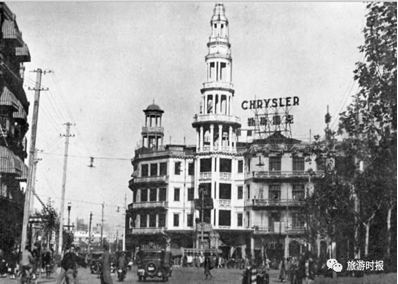
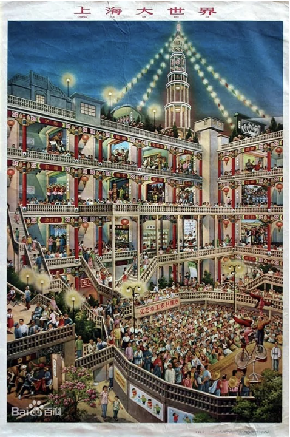

# 大世界

上海大世界位于西藏南路、延安东路的交叉口，建于1917年。大世界号称远东第一俱乐部，占地14700多平方米，内设有剧场、电影场、书场、杂耍台、商场、中西餐馆等。创办人黄楚九还在露天场地安装高空飞船以吸引儿童；“乾坤大剧场”可容纳千人，日映电影，夜演京戏。最具特色的就是“哈哈镜”了，能使人变长短和胖瘦。

大门、大厅和剧场主要仿西文古典式，内部为中国传统形式。中西合璧，是海派文化的代表性产物之一。

