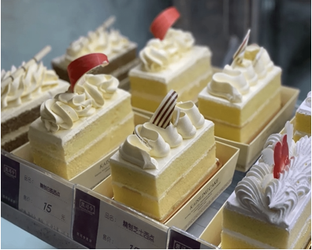

# 凯司令

凯司令创始于1928年，是一家集西点、西餐和咖啡店为一体的综合性西点店。凯司令蛋糕吸取德式蛋糕制作的方法，采用中国传统吉祥元素，极具海派特色。享誉全国的特色就是凯司令的奶油，十分精致细腻。作家张爱玲也提及过凯司令：“这家大概主要靠门市外卖，只装着寥寥几个卡位，虽然阴暗，情调毫无。靠里有个冷气玻璃柜台装着各色西点，后面一个狭小的甬道灯点得雪亮，照出里面的墙壁下半截漆成咖啡色，亮晶晶的凸凹不平。”

