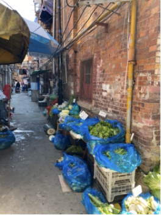

# 弄堂生意

小摊贩给弄堂抹上了一道特别的风景～

<iframe height=498 width=510 src='https://player.youku.com/embed/XMjkzOTM5NTU2NA==' frameborder=0 'allowfullscreen'></iframe>

https://v.youku.com/v_show/id_XMjkzOTM5NTU2NA 

“香是香来糯是糯，一粒开花两粒大，两粒开花鹅蛋大。”

“锵刀磨剪刀。”

“栀子花、白兰花。喷喷香的栀子花、白兰花。”

“修阳伞，坏的橡皮套鞋修哦。阿有啥坏的阳伞修哦。”

“桂花赤豆汤，白糖莲心粥。”

“牛庄咸蟹。”

“要哦蚂蚁布、格子布、香罗卜干、咸烤虾。”

