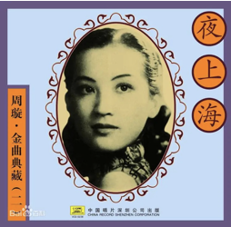

# 配乐

游戏采取中国传统音乐、1920-1940年代的热门曲目和相关地点的特色曲目。传统音乐有“春江花月夜”和“沧海一声笑”。游戏设定时期的热门曲目有“夜上海”、“魂萦旧梦”、“只要一个你”和“月圆花好”。特色曲目有小提琴曲“梁祝”、舞剧“胡桃夹子”、沪剧“罗汉钱”和“春节序曲”。

请欣赏周璇主演的《马路天使》里演唱的《天涯歌女》：https://haokan.baidu.com/v?pd=wisenatural&vid=2480932078532129566