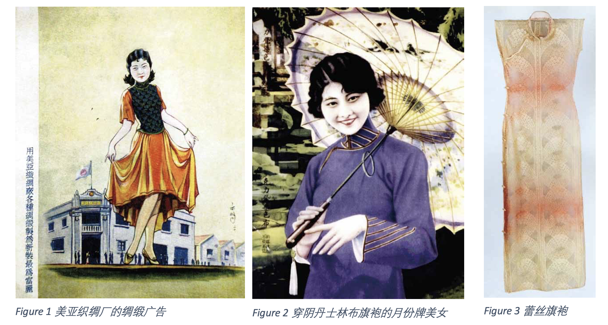
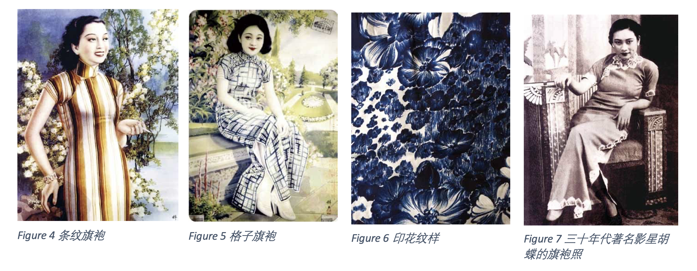

# 旗袍

民国旗袍有着中西合璧的风貌，成为民国女性的经典服装。这个变化彰显了海派文化在服装领域海纳百川的气度，是上海在近代时尚文化史上的重要贡献。从大平面的设计转为合身轮廓，从繁复的设计改为简便现代。民国时期主要的旗袍质地有绸缎、棉布、呢绒和蕾丝（针织）。常有的纹样有几何抽象图案、印花、外来风格和新颖表现手法（例如西方的写生技法和光影处理的方法）。人们的观念也发生了改变，比如寓意的重要性更多被纯粹的审美替代。只要花纹好看，无需特殊寓意。

