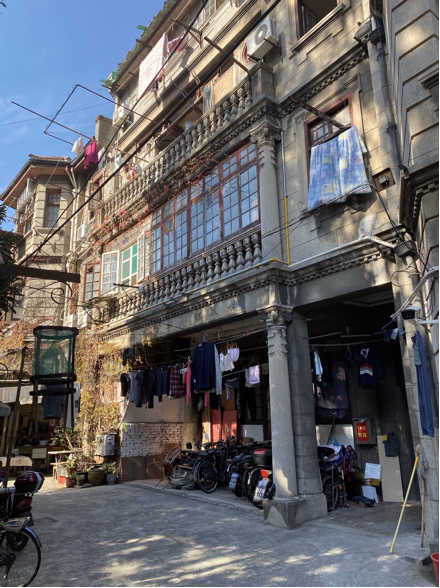
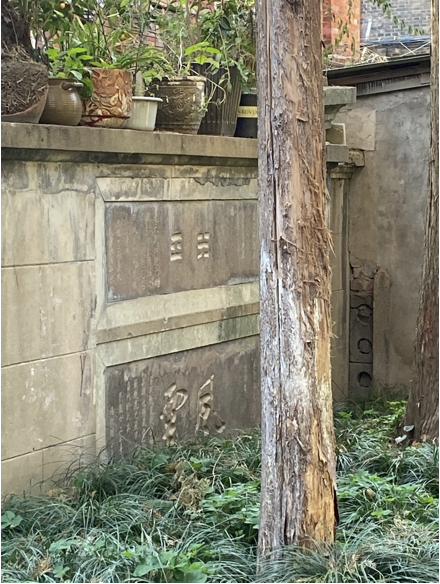

# 世界红十字会上海分会

这栋建筑位于长乐路中和村14号和15号，是一幢3层中式结构、西式装饰的花园住宅。整体对称分布，底层门廊和二层阳台设立爱奥尼立柱。红十字会提倡佛教、道教、儒教、伊斯兰教和基督教五教合一，以“促进世界和平，救济灾患”为主旨成立，着重推展慈善事业。

在花园里有两个竖牌：

> 正面中心刻有风云两字。左侧刻有一文：“云从龙，风从虎，物各从其类也。际风云之会合，为龙虎之飞变，世运将昌兆于此矣。民国二十二年重九福航韩世昌恭志”

> 正面中心刻有八卦中的离、坎两卦。左侧刻有诗文：“先天乾坤，后天坎离。水升火降，抽坎填离。由后返先，是曰既济。乾元开始，众妙归根。民国二十二年重九乾妙张澜平恭志。”

